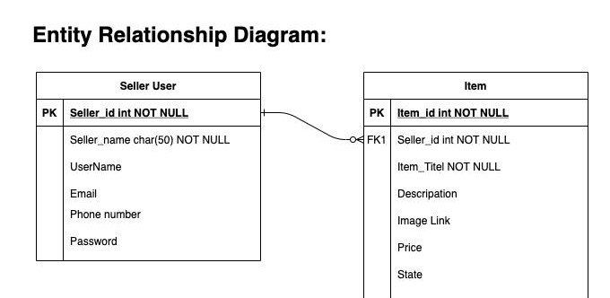
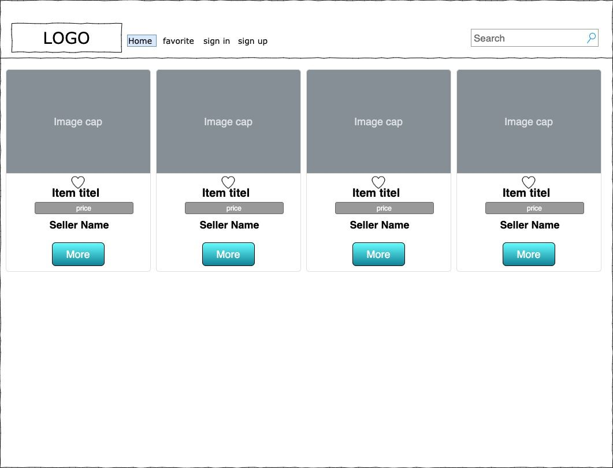
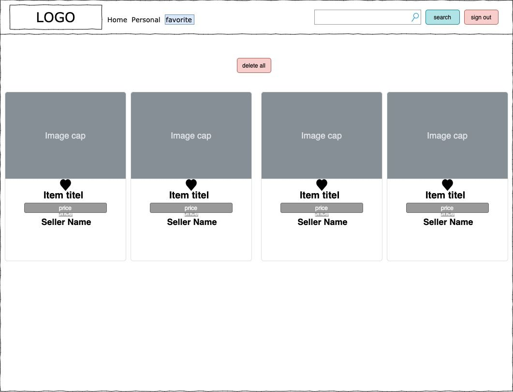
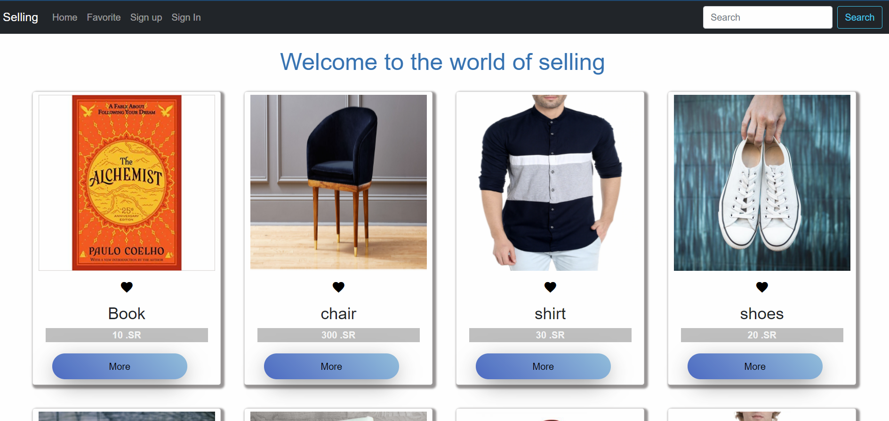
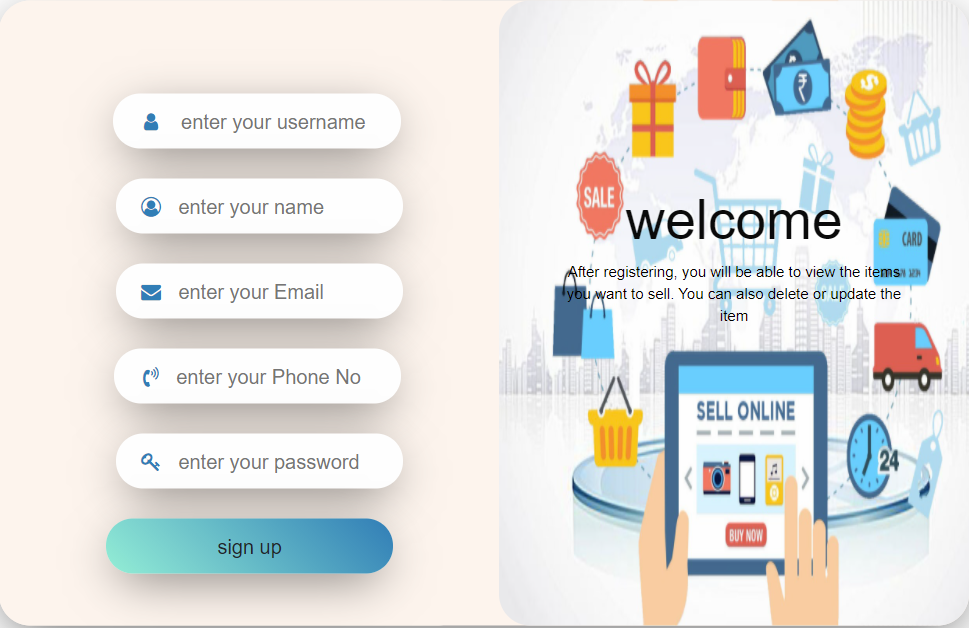
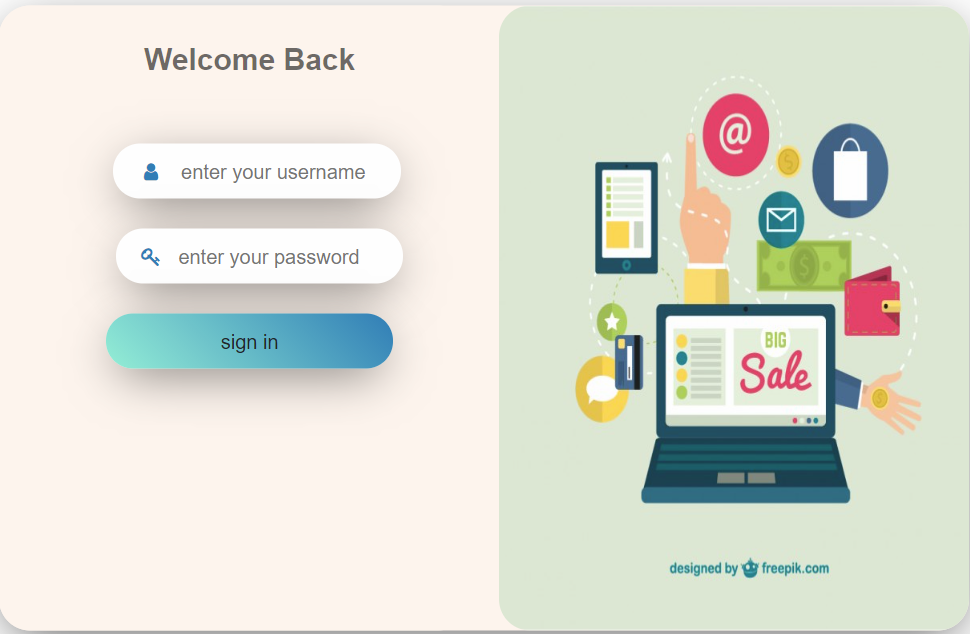
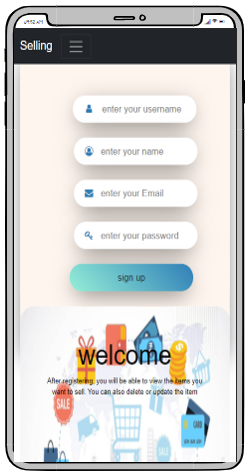

#   Selling Stuff
## :round_pushpin: Introduction
Selling stuff is a Single-Page-Applications that show you a list of different stuff
such as furniture, utensils, and books that their owner offer on the app for sale,
whether they are in a new or used condition.
As a user, you can view any item details. Also, you can search for an item by name or
add the item to your favorite list. In addition, you can display some of your stuff that you
want to sell by adding the item information so the user is able to see it. later on, you can
modify it, or removing it from your item list.

### :dart: Getting Started
### :pencil: Wireframe
Started the app by designing its layout framework by <a href= 'https://app.diagrams.net/'>Draw.io</a>. 

ER Digram

 

 

 

#
# Technologies Used.
* HTML
* CSS
* JavaScript (ES6)
* Axios
* Express
* Bootstrap
* Reacte js
* mongoose
* Postman 
* Asana 
* Heroku 

### :sunglasses: User Stories
* As a user, I should be able to see all items
* As a user, I should be able to search for an item
* As a user, I should be able to add any item to my favorite list
* As a user, I should be able to contact with the seller
* As a user (seller), I should be able to sign up
* As a user (seller), I should be able to sign in
* As a user (seller), I should be able to see my item list
* As a user (seller), I should be able to delete the item
* As a user (seller), I should be able to update the item information
* As a user (seller), I should be able to add a new item to my list

## :mag: App Preview

### :computer: The Web Application
- The Home Page:

Shows a list of valuable items that user can view more details about an item or add to favorite list or contact with seller.

 

- sign up page:

Welcome page, this page as a Form that takes all informaition about the seller to save it in our data base and then be able to sign in.

- sign in page:

page that takes only the username and seller password thats already stored in our data base.

- Seller Control Panel page:

list all seller item and the seller will be able to add new item, delete and edit on the list.

### :iphone: Phone Web Page
The web app also has a responsive design.

### :link: Links
* Live - <a href='https://project3sell.herokuapp.com/'> Selling  </a>
* Github - <a href='https://git.generalassemb.ly/ghaidaakhalil/Project-3'> Here </a>

### :sparkles:Future Features:
- Add Comment on item
- Rating item
- Filter item by status or price
- Contact vie live chat 

# Contributors
- Ghaidaa Khalil
- Fatimah Alhelal
- Aseel Al-Qasem
- Hind Alzhrani
